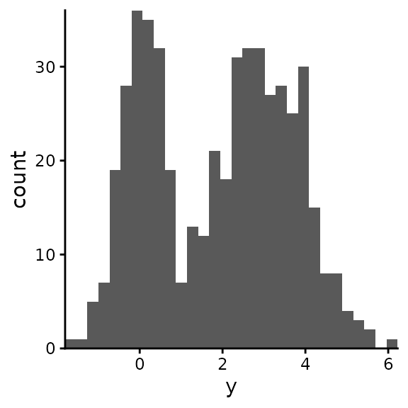
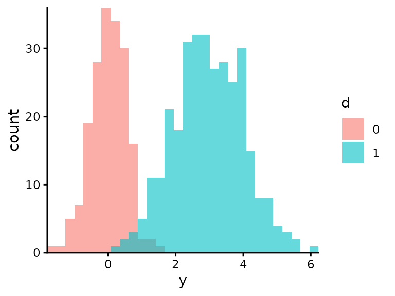
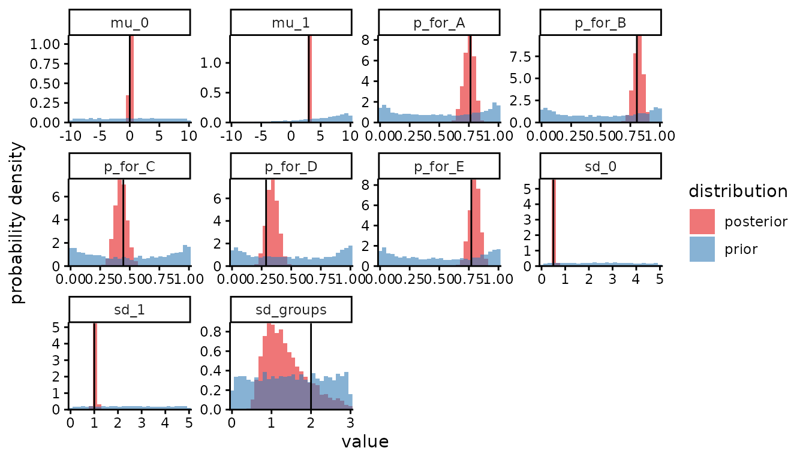
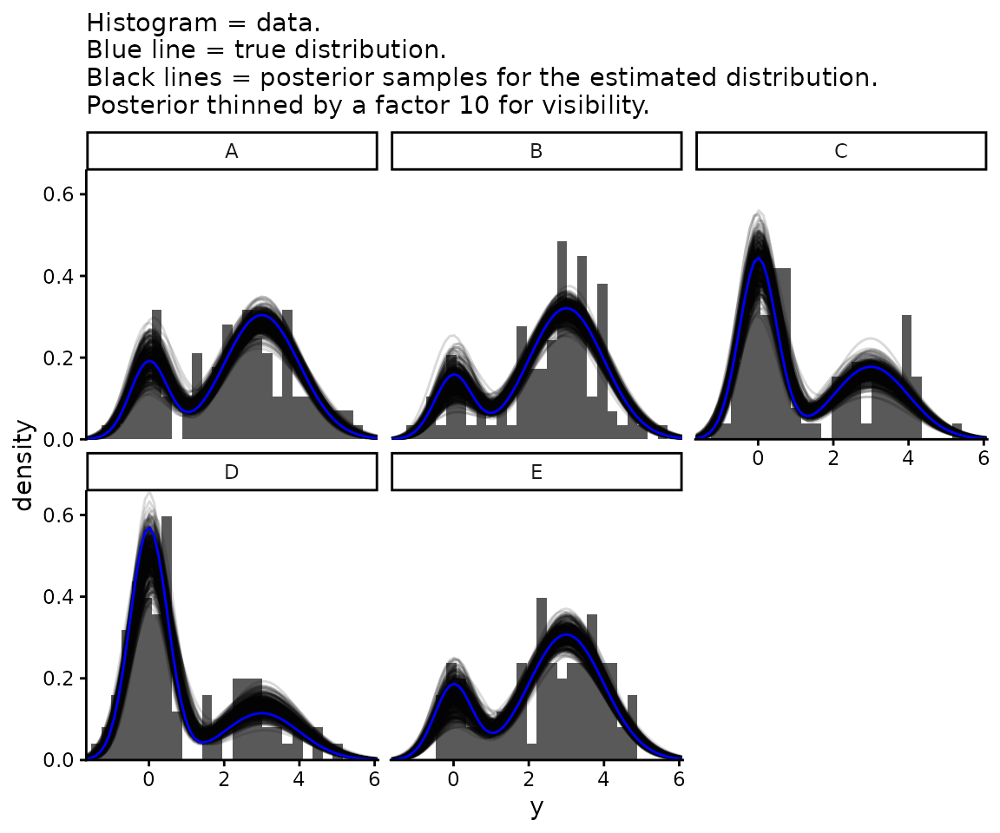
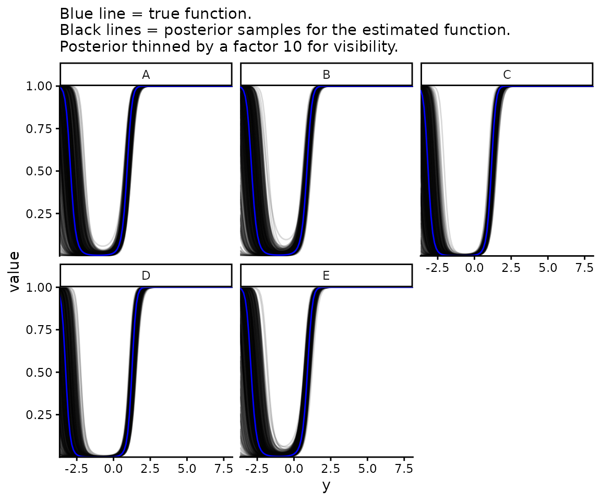

# Mixture of two normals

Consider the following model:

- $`i`$ indexes the observation  
- The unobserved binary variable $`d_i`$ equals 1 with probability
  $`p_i`$, 0 otherwise: $`d_i \: | \: p_i \sim \text{Bernoulli}(p_i)`$  
- The observed variable $`y_i`$ is normally distributed with parameters
  $`\mu_0, \sigma_0`$ if $`d_i=0`$, or normally distributed with
  parameters $`\mu_1, \sigma_1`$ if $`d_i=1`$. We can write this in a
  single equation:
  ``` math
  P(y_i \: | \: d_i, \mu_1, \sigma_1, \mu_0, \sigma_0) = d_i N(y_i \: | \: \mu_1, \sigma_1) + (1-d_i)  N(y_i \: | \: \mu_0, \sigma_0)
  ```
  For identifiability we define $`\mu_0 \leq \mu_1`$, i.e. whichever
  normal has the smaller mean we define to be $`d=0`$. We obtain the
  unconditional probability of $`y_i`$ without knowing $`d_i`$ by
  marginalising over $`d_i`$, giving a mixture of the two normals:
  ``` math
  \begin{aligned} P(y_i \: | \: p_i, \mu_1, \sigma_1, \mu_0, \sigma_0) = & \sum_{d_i} P(y_i \: | \: d_i, \mu_1, \sigma_1, \mu_0, \sigma_0) P(d_i \: | \: p_i) \\ = &  p_i N(y_i \: | \: \mu_1, \sigma_1) + (1-p_i)  N(y_i \: | \: \mu_0, \sigma_0)\end{aligned}
  ```
    
- There are $`n`$ discrete groups, indexed by
  $`g \in [1, 2, \ldots n]`$, which differ in their probabilities for
  $`d`$: $`p_g`$ is the probability that $`d_i=1`$ if $`i`$ is in $`g`$.
  Parameterise the variability between $`p_g`$ values with an overall
  parameter $`p`$, a length-$`n`$ vector $`\boldsymbol{\beta}`$ of
  unconstrained regression coefficients, and a logit link function to
  keep probability parameters between 0 and 1:
  $`p_g = \text{logistic}(\text{logit}(p) + \beta_g)`$. We thus use
  $`n+1`$ parameters to describe $`n`$ degrees of freedom, but this
  allows us to have identical and correlated priors for the $`n`$
  different groups (as opposed to picking one group as a reference and
  parameterising others relative to it, introducing greater uncertainty
  for the non-reference groups even before conditioning on the data).
  Specifically we model the different components of the vector
  $`\boldsymbol{\beta}`$ as normally distributed, independently given a
  scale parameter $`\sigma^\text{groups}`$:
  $`\beta_g \: | \: \sigma^\text{groups} \sim N(0, \sigma^\text{groups})`$
- The design matrix $`x_{ig}`$, which is observed, equals 1 if
  observation $`i`$ is in group $`g`$, 0 otherwise. So
  $`p_i = \sum_g x_{ig} p_g = \text{logistic}(\text{logit}(p) + \sum_g x_{ig} \beta_g)`$.

In summary, we have a logistic random-effects regression model for
$`d`$, and two-component normal mixture model for $`y`$ with $`d`$
indicating which component.

Set up our session

``` r

suppressPackageStartupMessages(library(mastiff))
suppressPackageStartupMessages(library(dplyr))
suppressPackageStartupMessages(library(ggplot2))
suppressPackageStartupMessages(library(magrittr))
suppressPackageStartupMessages(library(tidyr))
suppressPackageStartupMessages(library(stringr))

theme_set(theme_classic())
set.seed(12345) # For reproducibility
```

Simulate some data from a mixture of two normal distributions:

``` r

groups <- LETTERS[1:5]
results <- simulate_mixture_of_two_normals(n = 500,
                                           groups = groups,
                                           sd_groups = 2)
df_data <- results$data
params <- results$params
```

Inspect the data

``` r

head(df_data)
#>   group     d          y
#> 1     B  TRUE  3.8892457
#> 2     C FALSE  0.5479883
#> 3     B  TRUE  2.1813534
#> 4     A  TRUE  1.7631771
#> 5     A  TRUE  5.3172256
#> 6     D FALSE -0.1556485
```

Plot all the data

``` r

ggplot(df_data) +
  geom_histogram(aes(y), bins = 30) +
  coord_cartesian(expand = FALSE)
```



Visualise the two normals separately:

``` r

ggplot(df_data) +
  geom_histogram(aes(y, fill = as.factor(as.integer(d))),
                 position = "identity",
                 alpha = 0.6,
                 bins = 30) +
  coord_cartesian(expand = FALSE) +
  labs(fill = "d")
```



Estimate the parameters using Bayesian inference. For almost all
parameters we use uniform priors with specified upper and lower bounds.
(‘Almost all’ means all except the normally varying components of
$`\boldsymbol\beta`$, the group-specific values of $`p`$ that are
defined by $`\boldsymbol\beta`$, and $`\mu_1`$ for which we specify a
minimum and maximum but it is constrained to be greater than $`\mu_0`$.)

``` r

prior_boundaries <- tribble(
  ~param, ~lower, ~upper,
  "mu_0", -10, 10,
  "mu_1", -10, 10,
  "sd_0", 0, 5,
  "sd_1", 0, 5,
  "sd_groups", 0, 3,
  "p", 0, 1
  )
df_samples_posterior <- estimate_mixture_of_two_normals(
  y = df_data$y,
  groups = df_data$group, 
  prior_boundaries = prior_boundaries,
  report_stan_progress = TRUE)
#> 
#> SAMPLING FOR MODEL 'mixture_of_two_normals' NOW (CHAIN 1).
#> Chain 1: 
#> Chain 1: Gradient evaluation took 0.000274 seconds
#> Chain 1: 1000 transitions using 10 leapfrog steps per transition would take 2.74 seconds.
#> Chain 1: Adjust your expectations accordingly!
#> Chain 1: 
#> Chain 1: 
#> Chain 1: Iteration:    1 / 2000 [  0%]  (Warmup)
#> Chain 1: Iteration:  200 / 2000 [ 10%]  (Warmup)
#> Chain 1: Iteration:  400 / 2000 [ 20%]  (Warmup)
#> Chain 1: Iteration:  600 / 2000 [ 30%]  (Warmup)
#> Chain 1: Iteration:  800 / 2000 [ 40%]  (Warmup)
#> Chain 1: Iteration: 1000 / 2000 [ 50%]  (Warmup)
#> Chain 1: Iteration: 1001 / 2000 [ 50%]  (Sampling)
#> Chain 1: Iteration: 1200 / 2000 [ 60%]  (Sampling)
#> Chain 1: Iteration: 1400 / 2000 [ 70%]  (Sampling)
#> Chain 1: Iteration: 1600 / 2000 [ 80%]  (Sampling)
#> Chain 1: Iteration: 1800 / 2000 [ 90%]  (Sampling)
#> Chain 1: Iteration: 2000 / 2000 [100%]  (Sampling)
#> Chain 1: 
#> Chain 1:  Elapsed Time: 5.978 seconds (Warm-up)
#> Chain 1:                4.296 seconds (Sampling)
#> Chain 1:                10.274 seconds (Total)
#> Chain 1: 
#> 
#> SAMPLING FOR MODEL 'mixture_of_two_normals' NOW (CHAIN 2).
#> Chain 2: 
#> Chain 2: Gradient evaluation took 0.000137 seconds
#> Chain 2: 1000 transitions using 10 leapfrog steps per transition would take 1.37 seconds.
#> Chain 2: Adjust your expectations accordingly!
#> Chain 2: 
#> Chain 2: 
#> Chain 2: Iteration:    1 / 2000 [  0%]  (Warmup)
#> Chain 2: Iteration:  200 / 2000 [ 10%]  (Warmup)
#> Chain 2: Iteration:  400 / 2000 [ 20%]  (Warmup)
#> Chain 2: Iteration:  600 / 2000 [ 30%]  (Warmup)
#> Chain 2: Iteration:  800 / 2000 [ 40%]  (Warmup)
#> Chain 2: Iteration: 1000 / 2000 [ 50%]  (Warmup)
#> Chain 2: Iteration: 1001 / 2000 [ 50%]  (Sampling)
#> Chain 2: Iteration: 1200 / 2000 [ 60%]  (Sampling)
#> Chain 2: Iteration: 1400 / 2000 [ 70%]  (Sampling)
#> Chain 2: Iteration: 1600 / 2000 [ 80%]  (Sampling)
#> Chain 2: Iteration: 1800 / 2000 [ 90%]  (Sampling)
#> Chain 2: Iteration: 2000 / 2000 [100%]  (Sampling)
#> Chain 2: 
#> Chain 2:  Elapsed Time: 5.712 seconds (Warm-up)
#> Chain 2:                4.324 seconds (Sampling)
#> Chain 2:                10.036 seconds (Total)
#> Chain 2: 
#> 
#> SAMPLING FOR MODEL 'mixture_of_two_normals' NOW (CHAIN 3).
#> Chain 3: 
#> Chain 3: Gradient evaluation took 0.000168 seconds
#> Chain 3: 1000 transitions using 10 leapfrog steps per transition would take 1.68 seconds.
#> Chain 3: Adjust your expectations accordingly!
#> Chain 3: 
#> Chain 3: 
#> Chain 3: Iteration:    1 / 2000 [  0%]  (Warmup)
#> Chain 3: Iteration:  200 / 2000 [ 10%]  (Warmup)
#> Chain 3: Iteration:  400 / 2000 [ 20%]  (Warmup)
#> Chain 3: Iteration:  600 / 2000 [ 30%]  (Warmup)
#> Chain 3: Iteration:  800 / 2000 [ 40%]  (Warmup)
#> Chain 3: Iteration: 1000 / 2000 [ 50%]  (Warmup)
#> Chain 3: Iteration: 1001 / 2000 [ 50%]  (Sampling)
#> Chain 3: Iteration: 1200 / 2000 [ 60%]  (Sampling)
#> Chain 3: Iteration: 1400 / 2000 [ 70%]  (Sampling)
#> Chain 3: Iteration: 1600 / 2000 [ 80%]  (Sampling)
#> Chain 3: Iteration: 1800 / 2000 [ 90%]  (Sampling)
#> Chain 3: Iteration: 2000 / 2000 [100%]  (Sampling)
#> Chain 3: 
#> Chain 3:  Elapsed Time: 5.905 seconds (Warm-up)
#> Chain 3:                4.006 seconds (Sampling)
#> Chain 3:                9.911 seconds (Total)
#> Chain 3: 
#> 
#> SAMPLING FOR MODEL 'mixture_of_two_normals' NOW (CHAIN 4).
#> Chain 4: 
#> Chain 4: Gradient evaluation took 0.000131 seconds
#> Chain 4: 1000 transitions using 10 leapfrog steps per transition would take 1.31 seconds.
#> Chain 4: Adjust your expectations accordingly!
#> Chain 4: 
#> Chain 4: 
#> Chain 4: Iteration:    1 / 2000 [  0%]  (Warmup)
#> Chain 4: Iteration:  200 / 2000 [ 10%]  (Warmup)
#> Chain 4: Iteration:  400 / 2000 [ 20%]  (Warmup)
#> Chain 4: Iteration:  600 / 2000 [ 30%]  (Warmup)
#> Chain 4: Iteration:  800 / 2000 [ 40%]  (Warmup)
#> Chain 4: Iteration: 1000 / 2000 [ 50%]  (Warmup)
#> Chain 4: Iteration: 1001 / 2000 [ 50%]  (Sampling)
#> Chain 4: Iteration: 1200 / 2000 [ 60%]  (Sampling)
#> Chain 4: Iteration: 1400 / 2000 [ 70%]  (Sampling)
#> Chain 4: Iteration: 1600 / 2000 [ 80%]  (Sampling)
#> Chain 4: Iteration: 1800 / 2000 [ 90%]  (Sampling)
#> Chain 4: Iteration: 2000 / 2000 [100%]  (Sampling)
#> Chain 4: 
#> Chain 4:  Elapsed Time: 6.06 seconds (Warm-up)
#> Chain 4:                4.224 seconds (Sampling)
#> Chain 4:                10.284 seconds (Total)
#> Chain 4:
```

For plotting purposes we sample from the prior as well as the posterior:

``` r

df_samples_prior <- estimate_mixture_of_two_normals(
  y = df_data$y,
  groups = df_data$group, 
  prior_boundaries = prior_boundaries,
  sample_posterior_not_prior = FALSE)
```

In a single plot, for each parameter, we compare the posterior to the
prior and the posterior to the true value. (This is, respectively, to
show the relative contributions of prior assumptions and data to our
conclusions, and as a check that the statistical model was correctly
implemented. Read more about doing this, and why you should always do
it, in the vignette [Plotting Stan
output](https://bdi-pathogens.github.io/mastiff/articles/plotting-stan-output.md)).
Here we need the `skip_stanfit_to_dt` argument of
[`plot_posterior()`](https://bdi-pathogens.github.io/mastiff/reference/plot_posterior.md)
because we’re giving it samples stored as datatables instead of as
stanfit objects. In the plot, each panel is one parameter, and the black
vertical line is the true value.

``` r

plot_posterior(df_samples_posterior,
               prior_samples = df_samples_prior,
               true_param_values = params,
               skip_stanfit_to_dt = TRUE,
               params_desired = c("mu_0", "mu_1", "sd_0", "sd_1", "sd_groups", paste0("p_for_", groups)))
```



The estimation of `sd_groups` isn’t great, but that doesn’t matter
provided our estimates of `p` for each group are OK. Next we investigate
the distribution of $`y`$ after having marginalised over $`d`$, i.e. the
mixture of two normals, and how this distribution varies between groups.
First we calculate the true distribution given the true parameters. For
later convenience, at the same time as calculating
$`P(y) = P(y \: | \: d = 0) P(d = 0) + P(y \: | \: d = 1) P(d = 1)`$, we
also calculate as a function of y
$`P(d = 1 \: | \: y) = P(y \: | \: d = 1) P(d = 1) / P(y)`$.

``` r

y_values <- seq(from = min(df_data$y) - 2, to = max(df_data$y) + 2, length.out = 100)
true_ps <- params[paste0("p_for_", groups)]
df_y_distributions_true <- tibble(p = true_ps,
                                  group = names(true_ps)) %>%
  mutate(group = str_remove(group, "p_for_")) %>%
  cross_join(tibble(y = y_values)) %>%
  mutate(`P(y | d = 1)` = dnorm(y, params[["mu_1"]], params[["sd_1"]]),
         `P(y | d = 0)` = dnorm(y, params[["mu_0"]], params[["sd_0"]]),
         `P(y)` = p * `P(y | d = 1)` + (1 - p) * `P(y | d = 0)`,
         `P(d = 1 | y)` = p * `P(y | d = 1)` / `P(y)`) %>%
  select(group, y, "P(y)", "P(d = 1 | y)") %>%
  pivot_longer(cols = c("P(y)", "P(d = 1 | y)"),
               names_to = "which_function_of_y")
```

Second we calculate the estimated distributions.

``` r

df_y_distributions <- df_samples_posterior %>%
  as_tibble() %>%
  mutate(sample = row_number()) %>%
  select("sample", "mu_0", "mu_1", "sd_0", "sd_1", paste0("p_for_", groups)) %>%
  pivot_longer(cols = paste0("p_for_", groups),
               names_to = "group",
               values_to = "p",
               names_prefix = "p_for_") %>%
  cross_join(tibble(y = y_values)) %>%
  mutate(`P(y | d = 1)` = dnorm(y, mu_1, sd_1),
         `P(y | d = 0)` = dnorm(y, mu_0, sd_0),
         `P(y)` = p * `P(y | d = 1)` + (1 - p) * `P(y | d = 0)`,
         `P(d = 1 | y)` = p * `P(y | d = 1)` / `P(y)`) %>%
  select("sample", "group", "y", "P(y)", "P(d = 1 | y)") %>%
  pivot_longer(cols = c("P(y)", "P(d = 1 | y)"),
               names_to = "which_function_of_y")
```

We plot both of these together with the data.

``` r

posterior_thinning_factor <- 10 # Keep one in every 10 samples
ggplot() +
  geom_histogram(data = df_data, aes(x = y, y = after_stat(density)),
                 bins = 30) +
  geom_line(data = df_y_distributions %>%
              filter(which_function_of_y == "P(y)",
                     sample %% posterior_thinning_factor == 0),
            aes(x = y, y = value, group = sample), alpha = 0.15) +
  geom_line(data = df_y_distributions_true %>%
              filter(which_function_of_y == "P(y)"),
            aes(x = y, y = value), col = "blue") +
  coord_cartesian(expand = FALSE) +
  facet_wrap(~group) +
  theme_classic() +
  labs(subtitle = paste0("Histogram = data.\nBlue line = true distribution.\n",
                         "Black lines = posterior samples for the estimated ",
                         "distribution.\nPosterior thinned by a factor ",
                         posterior_thinning_factor, " for visibility.")) +
  xlim(min(df_data$y), max(df_data$y))
#> Warning: Removed 10 rows containing missing values or values outside the scale range
#> (`geom_bar()`).
#> Warning: Removed 68000 rows containing missing values or values outside the scale range
#> (`geom_line()`).
#> Warning: Removed 170 rows containing missing values or values outside the scale range
#> (`geom_line()`).
```



Now plot $`P(d = 1 \: | \: y) = P(y \: | \: d = 1) P(d = 1) / P(y)`$,
i.e. how likely each $`y`$ value is to have come from one normal
distribution or the other.

``` r

ggplot() +
  geom_line(data = df_y_distributions %>%
              filter(which_function_of_y == "P(d = 1 | y)",
                     sample %% posterior_thinning_factor == 0),
            aes(x = y, y = value, group = sample), alpha = 0.15) +
  geom_line(data = df_y_distributions_true %>%
              filter(which_function_of_y == "P(d = 1 | y)"),
            aes(x = y, y = value), col = "blue") +
  coord_cartesian(expand = FALSE) +
  facet_wrap(~group) +
  theme_classic() +
  labs(subtitle = paste0("Blue line = true function.\n",
                         "Black lines = posterior samples for the estimated ",
                         "function.\nPosterior thinned by a factor ",
                         posterior_thinning_factor, " for visibility."))
```



You can see at the smallest $`y`$ values that $`P(d = 1 \: | \: y)`$ is
not monotonic in $`y`$. This is always true for a mixture of two normal
distributions unless they have identical variances. If they don’t, the
one with the larger variances makes up an ever increasing proportion of
the mixture at both asymptotically positive and asymptotically negative
values of $`y`$. This may be problematic for applications where we want
$`P(d = 1 \: | \: y)`$ to be monotonic, i.e. where we believe that the
larger $`y`$ is the more likely it is to come from $`d=1`$ (or from
$`d=0`$ depending). In this case, the model may be an acceptable
application if the fitted model is monotonic over the range of $`y`$
values of interest. If not, a different mixture model using a
distribution other than a normal should be used.
