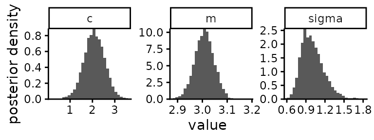
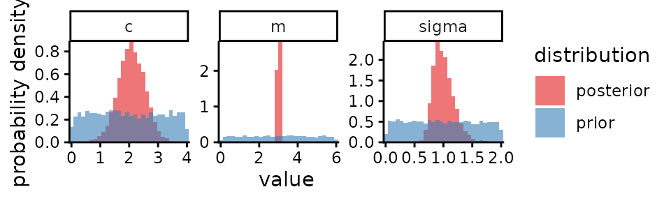
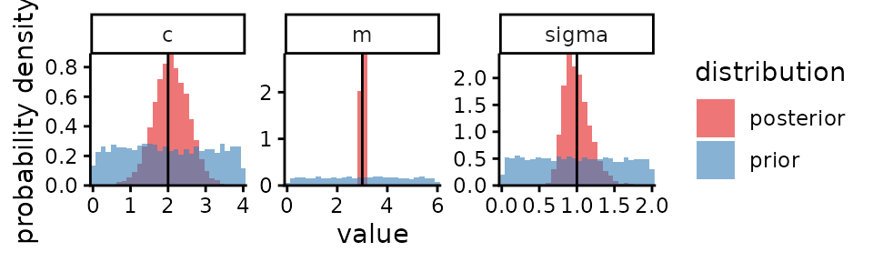
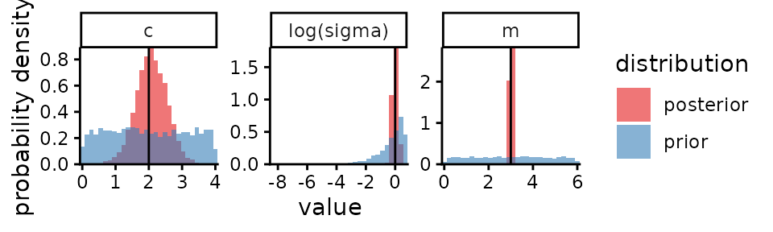

# Plotting Stan output

``` r
library(mastiff)
```

Load the example Stan output included with `mastiff`, from a simple
linear normal regression model: $y \sim N(mx + c,\sigma)$.

``` r
stan_eg <- mastiff::stan_example_regression
names(stan_eg)
#> [1] "posterior_samples" "prior_samples"     "true_values"
stan_eg$posterior_samples
#> Inference for Stan model: anon_model.
#> 4 chains, each with iter=2000; warmup=1000; thin=1; 
#> post-warmup draws per chain=1000, total post-warmup draws=4000.
#> 
#>        mean se_mean   sd   2.5%    25%   50%   75% 97.5% n_eff Rhat
#> m      3.01    0.00 0.04   2.93   2.98  3.01  3.03  3.08  1474    1
#> c      2.08    0.01 0.47   1.14   1.78  2.08  2.40  2.99  1516    1
#> sigma  1.01    0.01 0.18   0.72   0.88  0.98  1.11  1.43  1286    1
#> lp__  -9.83    0.05 1.44 -13.52 -10.48 -9.47 -8.78 -8.19  1016    1
#> 
#> Samples were drawn using NUTS(diag_e) at Thu Jun 19 18:44:33 2025.
#> For each parameter, n_eff is a crude measure of effective sample size,
#> and Rhat is the potential scale reduction factor on split chains (at 
#> convergence, Rhat=1).
```

For each parameter plot the marginal posterior (i.e. the posterior for
the value of that parameter regardless of any other parameter):

``` r
plot_posterior(stan_eg$posterior_samples)
```



Overlay plots of the posterior and prior distributions[¹](#fn1):

``` r
plot_posterior(stan_eg$posterior_samples,
               prior_samples = stan_eg$prior_samples)
```



For data that is simulated using the same likelihood that our inference
is based on, we know the true values of the parameters we are
estimating. Include those in our plots[²](#fn2):

``` r
plot_posterior(stan_eg$posterior_samples,
               prior_samples = stan_eg$prior_samples,
               true_param_values = stan_eg$true_values)
```



Specify a transformation for some parameters. Note the parameter names
are not automatically updated in the plot: handle this with `labels`
argument.

``` r
plot_posterior(stan_eg$posterior_samples,
               prior_samples = stan_eg$prior_samples,
               true_param_values = stan_eg$true_values,
               transforms = list(sigma=log),
               labels = c(sigma = "log(sigma)")
               )
```



------------------------------------------------------------------------

1.  You should always do this for the key parameters of a model (perhaps
    excluding less relevant parameters, especially if there are so many
    of them this would be distracting), so that you and your audience
    can see how much of your conclusion is coming from the data and how
    much is coming from prior assumptions. Also so that you and they can
    check for prior-posterior conflict, e.g. if the posterior is
    squashed right towards one end of the prior (and if that end is not
    a hard limit of the model itself, such as 0 or 1 for a probability
    parameter).

2.  Checking that our posteriors are closer to the true values than the
    priors are provides a check that we have correctly implemented our
    statistical model. You should always do such a check. For simple
    models it is very quick; for more complex models it is very
    important, because with greater model complexity comes greater risk
    of at least one error in coding the inference. Posteriors should
    become increasingly concentrated at the true parameter values as the
    size of the dataset increases, assuming the parameters are to some
    degree identifiable by this kind of data. If some parameters are not
    at all identifiable, their posteriors should remain equal to their
    priors regardless of the amount of data. If posteriors become
    increasingly concentrated at any value other than the true value,
    this indicates an error in the implementation of the statistical
    model (or an error in the simulation code you wrote to check your
    inference code).
